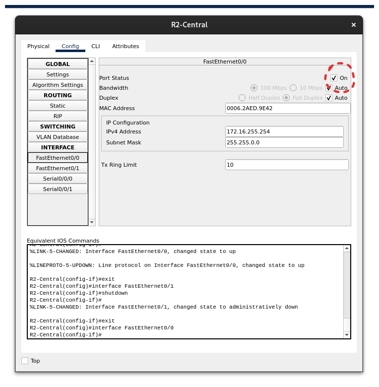

# Solución Packet Tracer 1

## Gateways

Para solucionar el problema era necesario activar el puerto **FastEthernet0/0** en el router R2-Central.

## Para los demás

Los demás ejercicios no necesitaban solución solo se debía seguir la guia dentro de cada uno.
