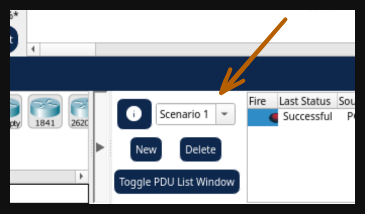

# Solución Packet Tracer 2

## Dominios de broadcast

Para este deben seguir los pasos para de las instrucciones y entender las simulación en ambos escenarios.



## Ruta faltante

Se comienza por verificar el router colocando las contraseñas dadas. Se entra en modo exec haciendo `enable` el cli del router.

Luego se entra en modo config haciendo `config` y se hacen los cambios solicitados:

```bash
no ip route 172.16.3.0 255.255.255.0 s0/0/1
ip route 172.16.3.0 255.255.255.0 s0/0/0
```

Se guarda la configuración saliendo con `Ctrl+z` y se guarda con el comando `copy run start`. Ahora el ping de PC2 a PC1 debería fncionar:

```bash
C:\>ping 172.16.3.10

Pinging 172.16.3.10 with 32 bytes of data:

Reply from 172.16.3.10: bytes=32 time=37ms TTL=126
Reply from 172.16.3.10: bytes=32 time=22ms TTL=126
Reply from 172.16.3.10: bytes=32 time=14ms TTL=126
Reply from 172.16.3.10: bytes=32 time=22ms TTL=126

Ping statistics for 172.16.3.10:
    Packets: Sent = 4, Received = 4, Lost = 0 (0% loss),
Approximate round trip times in milli-seconds:
    Minimum = 14ms, Maximum = 37ms, Average = 23ms
```
