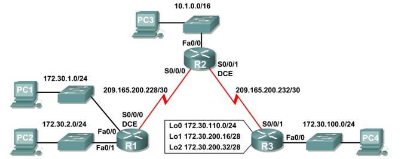

## Indice

- [RIPv2](#ripv2)
- [OSPF](#ospf)

# Solución Packet Tracer 3

## RIPv2

Antes de comenzar hay que cablear la red, se veria de la siguiente manera:



Se reiniciana la configuración de cada router:

```sh
enable
erase startup-config
y
reload
y
```

Se cargan los diferentes scripts dados en cada router.

Se desctiva CEF en R2 para hacer las prubas de los pings:

```sh
enable
config terminal
no ip cef
end
exit
```

De R2 a PC1 () se transmisten 3/5 (60%), respecto a las máquinas se tiene que:

| Fuente | Destino             | Hace `ping` | Acierto |
| ------ | ------------------- | ----------- | ------- |
| PC1    | PC2 (172.30.2.10)   | Sí          | 100%    |
| PC1    | PC3 (10.1.0.10)     | Sí          | 50%     |
| PC1    | PC4 (172.30.100.10) | No          | 0%      |
| PC4    | PC2 (172.30.2.10)   | No          | 0%      |
| PC4    | PC3 (10.1.0.10)     | Sí          | 50%     |

Se cambia el RIP a RIPv2 en cada router:

```sh
enable
config terminal
router rip
version 2
end
exit
```

Las entradas de RIP envidas desde R3 son:

- 10.0.0.0/8
- 172.30.100.0/24
- 172.30.110.0/24
- 172.30.200.16/28
- 209.165.200.0/24

Las ruta que actualizan RIP que en R2 que se reciben de R3 son:

- 172.30.0.0/16

Se desactiva el resumen automatico de RIP en cada router:

```sh
enable
config terminal
router rip
no auto-summary
end
exit
```

Ahora R1 envia actualizaciones de las siguientes rutas:

- 172.30.1.0/24
- 172.30.1.0/24

Además estas mismas son recibidas por R2 junto con las mascaras de subred.

Se hacen prueba de pign:

| Fuente | Destino             | Hace `ping` | Acierto |
| ------ | ------------------- | ----------- | ------- |
| R2     | PC1 (172.30.1.10)   | Sí          | 100%    |
| PC1    | PC2 (172.30.2.10)   | Sí          | 100%    |
| PC1    | PC3 (10.1.0.10)     | Sí          | 100%    |
| PC1    | PC4 (172.30.100.10) | Sí          | 100%    |
| PC4    | PC2 (172.30.2.10)   | Sí          | 100%    |
| PC4    | PC3 (10.1.0.10)     | Sí          | 100%    |

# Solución Packet Tracer 4

## OSPF

Primero se deben hacer las configuraciones inciales a los routers:

```sh
enable
config terminal
hostname R3
no ip domain-lookup
enable secret class
line console 0
password cisco
login
exit
line vty 0 15
password cisco
login
exit
end
write memory
```

Ahora se proceden a configurar las IPs y activar las interfaces para Routers y PCs siguiendo la tabla dada. Despues de esto se configura OSPF para el router R1:

```sh
router ospf 1
network 172.16.1.16 0.0.0.15 area 0
network 192.168.10.0 0.0.0.3 area 0
network 192.168.10.4 0.0.0.3 area 0
end
```

Ahora se hacen las configuraciones para el router R2:

```sh
router ospf 1
network 10.10.10.0 0.0.0.255 area 0
network 192.168.10.0 0.0.0.3 area 0
network 192.168.10.8 0.0.0.3 area 0
end
```

Por ultimo la configuración para el router R3:

```sh
router ospf 1
network 172.16.1.32 0.0.0.7 area 0
network 192.168.10.4 0.0.0.3 area 0
network 192.168.10.8 0.0.0.3 area 0
end
```

Las ID para R1, R2 y R3 son `192.168.10.5`, `192.168.10.9` y `192.168.10.10` respectivamente.

Ahora se configura el loopback para cada uno de los routers:

#### R1

```sh
interface loopback 0
ip address 10.1.1.1 255.255.255.255
end
reload
yes
```

#### R2

```sh
interface loopback 0
ip address 10.2.2.2 255.255.255.255
end
reload
yes
```

#### R3

```sh
interface loopback 0
ip address 10.3.3.3 255.255.255.255
end
reload
yes
```

Ahora los ID cambiaron para R1, R2 y R3 a `10.1.1.1`, `10.2.2.2` y `10.3.3.3` respectivamente.

Se cambian el badnwith de los routers R1 y R2:

```sh
interface serial0/0/0
bandwidth 64
interface serial0/0/1
bandwidth 64
```

Ahora para R3 pero con un comando diferente:

```sh
interface serial0/0/0
ip ospf cost 1562
interface serial0/0/1
ip ospf cost 1562
```

Se configura el loopback 1 para R1:

```sh
interface loopback1
ip address 172.30.1.1 255.255.255.252
ip route 0.0.0.0 0.0.0.0 loopback1
router ospf 1
default-information originate
end
```
