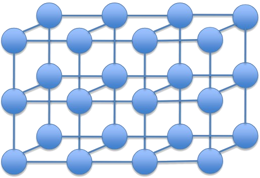
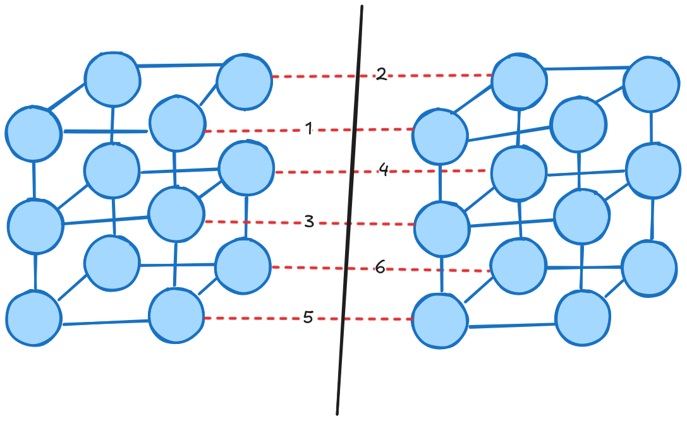
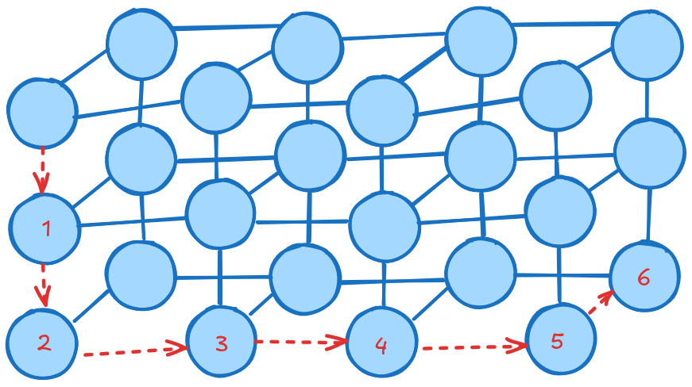

# Solución Quiz 1 - G5

#### 1. Calcular el ancho de banda de la bisección y el diámetro de la siguiente red:

Tomando en cuenta que la bisección de una red se puede definir como la cantidad de enlaces que se deben "cortar" para dividir una red en 2 partes iguales. Se puede ver la siguiente imagen como solución:

Por lo tanto, la bisección sería de 6. Y al no tener un valor para el ancho de banda de los enlaces, se puede usar alguna variable para idenficarlo. En este caso se usará $R$. **Y como la pregunta es sobre el ancho de banda de la bisección**, esto lo calculamos haciendo $\text{ancho de banda de un enlace} \times \text{bisección}$

$$
\text{ancho de banda de la bisection} = 6 \times R
$$

Para el diámetro, se puede calular la distancia maxima entre dos nodos de la red. Una forma fácil de hacerlo es trasando esta ruta. Un ejemplo con la topologia dada seria:

Por lo tanto, el diámetro sería de $6$.

#### 2. ¿Cuál es la principal diferencia entre UDP y TCP?

La principal diferencia es que **TCP es un protocolo orientado a la conexión**, mientras que **UDP no lo es**. Esto significa que TCP primero establece una conexión antes de enviar los datos, asegurándose de que lleguen correctamente. En cambio, UDP envía los datos directamente sin establecer una conexión previa, y no garantiza que los datos lleguen o que lo hagan en el orden correcto.

#### 3. Indique tres retardos distintos en una red de conmutación de paquetes.

Cualquiera de los siguientes está correcto:

- Retraso de **procesamiento**: tiempo que se tarda de en procesar el paquete.
- Retraso de **transmisión**: tiempo que se tarda en cargar los bits al enlace.
- Retraso de **propagación**: tiempo que se tarda un packete en llegar de router a router.
- Retraso de **cola**: tiempo que se queda un paquete en espera a ser enviado.

#### 4. Una imagen de 1600x1200 pixels en la que cada pixel utiliza 3 bytes/pixel. Suponga que la imagen no esta comprimida. ¿Cuánto tiempo se tarda para transmitir el archivo en una línea de 1 Mbps en cable modem?

$$
\text{total de bytes} = \text{bytes de datos} \times \text{bits por byte} \\
\text{total de bytes} = 1600 \times 1200 \times 3 \\
\text{total de bytes} = 5760000 \\
$$

Para calcular el tiempo de transmisión, se utiliza la formula $\frac{bits}{bits/s}$.

$$
\text{total de bits} = 5760000 \times 8 \\
\text{total de bits} = 46080000 \\
$$

Por lo tanto, el tiempo de transmisión sería:

$$
\frac{46080000_{bits}}{1000000_{bits/segundo}} = 46.08_{segundos}
$$
