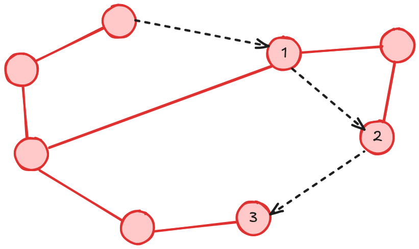

# Solución a la Tarea 1

**Grado:**

Se puede calcular como el promedio del grado de cada nodo, con la formula:

$$
 \frac{2 \times \text{aristas}}{\text{nodos}} = \frac{20}{8} = 2.5
$$

Por lo tanto el grado de la red seria de 2.5 o 2 para que sea constante.

**Diametro:**

Como se puede ver en la imagen, el diametro de la ted es de 3.

**Ancho de banda de bisección:**

Como se puede ver en la imagen, el ancho de banda de bisección es de $3\times R$, siendo $R$ el ancho de banda de los enlaces.

**Topologia:**

