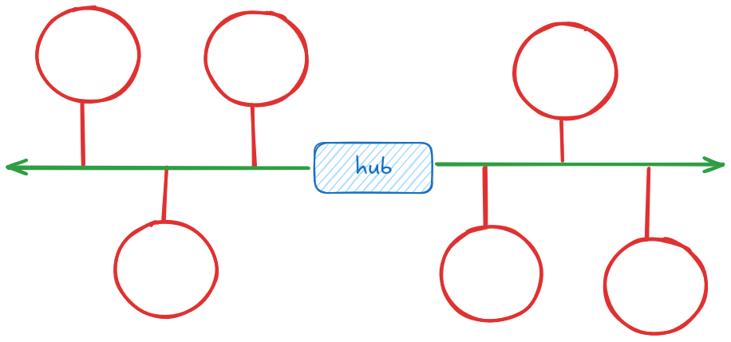

# Solución a la Tarea 1

Degree:

$$
 \frac{\text{aristas} \times 2}{\text{nodos}} = \frac{20}{8} = 2.5
$$

Por lo tanto el `degree` de la red seria de 2.5 o 2 para que sea constante.

Diameter:

$$
\frac{8}{2} = 4
$$

Por lo tanto el `diameter` de la red seria de 4.

Bisection bandwidth:

$$2 \times r$$

Esto por que la topoplogía es basicamente de `ring`, pero con tres nodos con una conexión extra.

Topologia:

