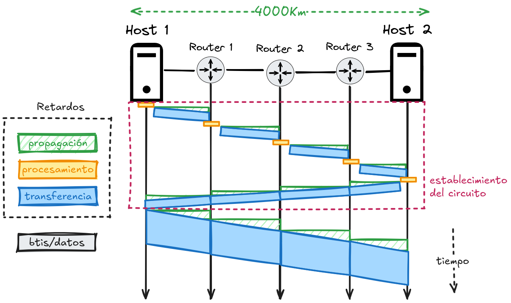

# Solución de Tarea 3

Para la solución se tienen los siguientes datos:

- Tamaño del paquete: $10 Mb$
- El tamaño del datagrama: $65Kb$
- Distancia entre los nodos: $4000km$
- Routers entre nodos (misma distancia entre ellos): $3$
- Velocidad de propagación: $200000km/s$
- Ancho de banda de transmisión: $100kbps$
- Retardo de procesamiento: $100ms$
- _Omitir retardo de procesamiento en hosts_

Para la solución se pueden utilizar las siguientes formulas:

- $\text{total delay} = d_{proc} + d_{prop} + d_{trans}$
- $\text{total delay} = m \times (s+\frac{A+M}{R}) + d_{prop}$
- $\text{total delay} = (m-1) \times (\frac{A+P}{R}) + \frac{M}{P} \times (\frac{A+P}{R}) + d_{prop}$

Para facilitar los calculos se usará la primera fórmula, y se adaptará para cada tipo de comunicación.

## Solución Circuit Switching

Para este tipo de comunicación se tiene la siguiente fórmula para calcular el retardo:

$$
\text{total delay} = d_{proc} + d_{prop} + d_{trans}
$$

$$
\text{total delay} = d_{proc} + \frac{l}{c} + \frac{p}{r}
$$

Donde:

- $l$ = longitud del enlace ($m$)
- $c$ = tiempo de propagación ($m/s$)
- $p$ = tamaño del paquete ($b$)
- $r$ = velocidad de transmisión ($m/s$)

Antes de calcular el retardo total, es necesario tomar en cuenta como se vería la comunicación en este caso:

Como se puede observar, para cada router se tiene que calcular su procesamiento a la hora de enviar los datos de control para establecer el circuito, después de eso ya no se hará ningun proceso en los routers, pues la ruta queda ya establecida. Luego habría que calcular el retardo de **transmisión** y de **propagación** al enviar los datos de control, al recibir la confirmación y al enviar el archivo.

Para facilitar los calculos, y puesto que no se brinda el tamaño de los datos de control, se omititá esto dentro de los calculos como sea correspondiente para cada caso. Por lo que circuit switching, al no enviarse ningun dato de control, la comunicación se pude ver de la siguiente forma:

> [!WARNING]
> El procesamiento que se da en los host, por el enunciado no se estan tomando en cuenta en los calculos.

### Calcular el retardo de procesamiento en los routers

$$
d_{proc} = 3 \times 100ms = 300ms = 0,3 s
$$

### Calcular el retardo de propagación

$$
d_{prop} = \frac{l}{c}
$$

$$
d_{prop} = \frac{4000km}{200000km/s} \times 3
$$

$$
d_{prop} = 0,02s \times 3 = 0,06
$$

Se multiplica por $3$ porque se está tomando en cuenta la propagación al enviar los datos de control, la confirmación y el archivo.

### Calcular el retardo de transmisión

Al enviar el archivo:

$$
d_{trans} = \frac{p}{r}
$$

$$
d_{trans} = \frac{10Mb}{100kbps}
$$

Pasando $10Mb$ a kilo bits:

$$
d_{trans} = \frac{10000kb}{100kbps} = 100s
$$

---

Por lo tanto se tendria que el retardo total sería:

$$
\text{total delay} = d_{proc} + d_{prop} + d_{trans}
$$

$$
\text{total delay} = 0,3s + 0,06s + 100s = 100,36s
$$

## Solución Message Switching

Para esta solución es importante la diferencia frente a circuit switching:

Como se puede ver en el gráfico, con esta forma de comunicación el paquete (mensaje) se envía a cada uno de los dipositivos intermediarios, estos guardan todo el paquete y luego lo envian a donde corresponda (**store-and-forward**).

### Calcular el retardo de propagación

$$
d_{prop} = \frac{l}{c}
$$

$$
d_{prop} = \frac{4000km}{200000km/s} = 0,02s
$$

### Calcular el retardo de transmisión

Ya que se hacer **store-and-forward** el tiempo de transmisión hay que multiplicarlo por la candidad de "saltos", que serian 4:

$$
d_{trans} = \frac{10000kb}{100kbps} \times 4 = 400s
$$

---

Por lo tanto se tendria que el retardo total sería:

$$
\text{total delay} = d_{proc} + d_{prop} + d_{trans}
$$

$$
\text{total delay} = 0,3s + 0,02s + 400s = 400,32s
$$

## Solución Datagram (Packet) Switching

Esta forma de comunicación es similar a la anterior, pero en este caso se divide el paquete en fragmentos lo que haría que se vea asi:

Para calcular bien el retardo en este caso, hay que tomar en cuenta que el retardo de transmisión es el retardo de enviar todos los paquetes, más el retardo de enviart un paquete multiplicado por la cantidad de "saltos" menos 1. Esto se puede ver claramente en el diagrama anterior, por lo tanto:

### Calcular el retardo de transmisión

Puesto que el paquete se divide en fragmentos, se tiene que calcular el tamaño de cada fragmento que serán los paquetes que se envien:

$$
k = \frac{10000kb}{65kb} = 154 paquetes
$$

$$
d_{trans} = \frac{p}{r}
$$

$$
d_{trans} = \frac{65kb}{100kbps} =  0,65s
$$

---

Por lo tanto, teniendo el tiempo que tarda en enviar un paquete, se puede calcular el retardo total, teniendo $m$ como la cantidad de "saltos" y $k$ la cantida de paquetes:

$$
\text{total delay} = d_{proc} \times k + d_{prop} + d_{trans} \times k + (m-1)  \times d_{trans}
$$

$$
\text{total delay} = 0,3s \times 154 + 0,02s + 0,65s \times 154 + (4-1) \times 0,65s
$$

$$
\text{total delay} = 46,2 + 0,02s + 100,1s + 1,95s = 148,27s
$$

> [!NOTE]
> Se multiplica el retardo de procesamiento por la cantidad de paquetes, se podría omitir este paso.
