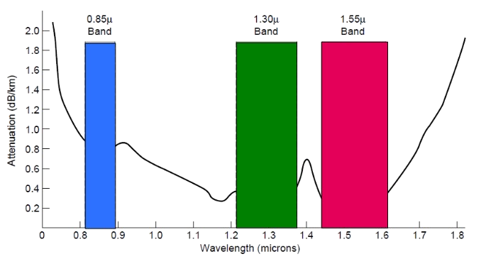

# Solución a la Tarea 5

- In Fig. 2-5, the left-hand band is narrower than the others. Why?

Porque tiene menos longitud de onda.
Representa las primeras bandas que se utilizaron para la comunicación fibra óptica, es más estrecha que las otras porque es el rango de longitud de onda con menor atenuación que era factible construir con latecnología de la epoca.

- Television channels are 6 MHz wide. How many bits/sec can be sent if four-level digital signals are used? Assume a noiseless channel.

El teorema de **Nyquist** nos da la formuala para calcular la velocidad maxima de un canal, sin ruido/interferencia:

$$
\text{max. data rate} = 2 \times \text{bandwidth} \log_2(\text{niveles de bits señal}) \\
\text{max. data rate} = 2 \times \text{6000000} \log_2 (\text{4}) \\
\text{max. data rate} = 24 \text{MHz}
$$

- If a binary signal is sent over a 3-kHz channel whose signal-to-noise ratio is 20 dB, what is the maximum achievable data rate?

El teorema de **Shannon** nos da la formula para calcular la velocidad maxima de un canal, con ruido/interferencia, tomando encuenta que ya nos dan $S/N$:

$$
\text{max. data rate} = \text{bandwidth} \times \log_2(1 + S/N)
$$

$$
S/N = 20 \text{dB} = 10 \times \log_{10}(100)
$$

$$
\text{max. data rate} = \text{3000} \times \log_2(101) \\
\text{max. data rate} = 19.97 \text{KHz}
$$

- In a typical mobile phone system with hexagonal cells, it is forbidden to reuse a frequency band in an adjacent cell. If 840 frequencies are available, how many can be used in a given cell?

Normalmente un sistema de celdas, se suele dividir en 7 celdas cada una puede utilizar un rango de frecuencias, para evitar interferir con otras celdas. Esto se puede ver claramente acá:

Por lo cual se puede calcular la cantidad de frecuencias que se pueden utilizar en cada celda:

$$
\frac{840}{7} = 120
$$

- Make a rough estimate of the number of PCS microcells 100 m in diameter it would take to cover San José (45 square km)

Para calcular el radio de la microcelda, $area = \pi \times (\frac{d}{2})^2$, por lo cual $area = \pi \times (\frac{100}{2})^2 = 7853.98m^2$. Con esto podemos calular el numero de celdas necesarias:

$$
\frac{45000m^2}{7853.98m^2} = 7.854\_\text{celdas}
$$
