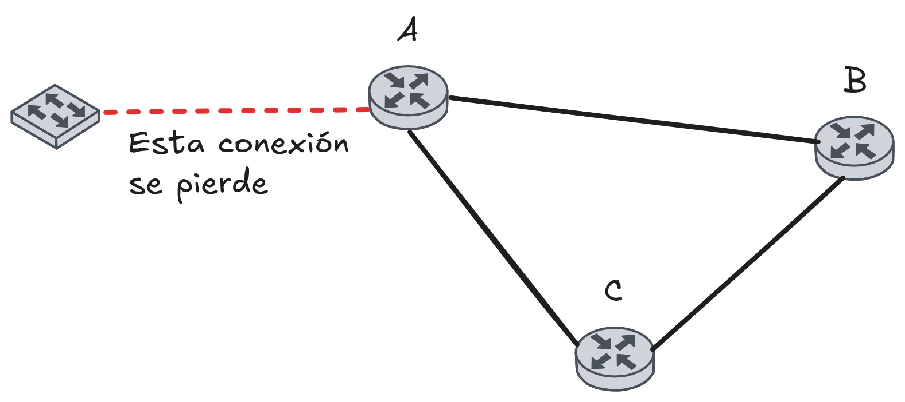

# Solución de la tarea 7

## Primera pregunta

### Vector Distance

Para poder averiguar el ancho de banda se puede utilizar la siguiente fórmula:

$$
\text{Ancho de banda} = R \times M \times T \times V
$$

Donde:

- $R$ es la cantidad de routers
- $M$ es la cantidad de mensajes por segundo

Para calcular $M$ se podia hacer $\frac{1}{0,1}$ que seria igual a $10$ o en su defecto no multiplicar por M y dividir todo entre $0,1$ que es la equivalencia de $100ms$ a $s$

- $T$ es el tamaño de los mensajes

El calculo de $T$ depende de lo que hayan asumido, pero en general deberia tener una estructura de:

$$
T = (\text{bytes de destino} + \text{bytes de costo}) * R
$$

Esto por que Distance Vector guarda un registro de cada uno de los routers.

- $V$ es la cantidad de vecinos

> [!WARNING]  
> Recordar que Distance Vector envia la tabla de vectores solo a sus vecinos. Por eso en la formula se multiplica por los vecinos.

### Link State

En el caso de Link State se puede utilizar la siguiente fórmula:

$$
\text{Ancho de banda} = R \times M \times T \times L
$$

Donde:

- $L$ es la cantidad de links a los que se envia el mensaje.

Para calcularlo se debe realizar la operación $\frac{R\times V}{2}$.

> [!WARNING]  
> El calculo de $R\times V$ toma en cuenta la relación bidireccional entre los routers, es decir A-B y B-A lo cuenta como 2 links, pero deberían ser solo 1, pore eso se divide entre 2.

## Segunda pregunta: How can flooding and broadcast be said to be similar to each other? How do they differ? Name one way in which they are similar/different.

- Son similres porque ambos envian mensjaes a multiples direcciones de una red.

- Pero son diferentes porque broadcasts se envian a un conjunto de direcciones específicas, en cambio flooding se envía a todas las direcciones vecinas de la red.

## Tercera pregunta: Split horizon does not always help in avoiding the count-to-infinity problem. Illustrate a case where it fails (make routing tables - show 2 iterations).

Se tiene de caso la siguiente toplogía:

### Iteración 0 (Estado Inicial)

| Router | Destino | Métrica | Próximo Salto |
| ------ | ------- | ------- | ------------- |
| A      | D       | 1       | -             |
| B      | D       | 2       | A             |
| C      | D       | 2       | A             |

### Iteración 1 (Falla el enlace en Router A)

En este caso se asume que se perdio el paquete que envio A a C para actualizar el fallo.

| Router | Destino | Métrica  | Próximo Salto |
| ------ | ------- | -------- | ------------- |
| A      | D       | $\infty$ | -             |
| B      | D       | $\infty$ | A             |
| C      | D       | 2        | A             |

### Iteración 2

Cuando C actualice, va a enviar los paquetes erroneos y se va a crear un bucle.

| Router | Destino | Métrica | Próximo Salto |
| ------ | ------- | ------- | ------------- |
| A      | D       | 4       | -             |
| B      | D       | 3       | A             |
| C      | D       | 2       | A             |
